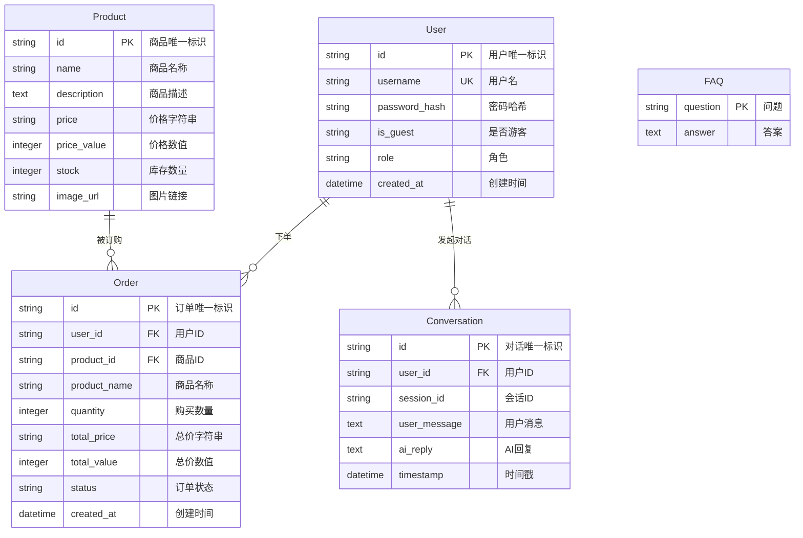

# X-Drone 数据库设计文档

## 1. 数据库选型

### 1.1 数据库类型

**生产环境：PostgreSQL**
- 云服务商：Supabase / Railway
- 特性支持：
  - 完整的 ACID 事务支持
  - JSON 数据类型支持
  - 强大的索引和查询优化
  - SSL 安全连接
  - 时区感知的时间戳处理

**本地开发：SQLite**
- 文件型数据库，无需额外服务
- 快速开发和测试
- 与 PostgreSQL 兼容（通过 SQLAlchemy ORM）

### 1.2 连接池配置

```python
# SQLite 配置
pool_size = 1
max_overflow = 0
pool_recycle = 1800

# PostgreSQL 配置
pool_size = 5
max_overflow = 10
pool_recycle = 1800
pool_pre_ping = True
```

**配置说明：**

| 参数 | SQLite | PostgreSQL | 说明 |
|------|--------|------------|------|
| pool_size | 1 | 5 | 连接池保持的连接数 |
| max_overflow | 0 | 10 | 超出 pool_size 后允许的最大额外连接 |
| pool_recycle | 1800秒 | 1800秒 | 连接回收时间，避免长时间连接超时 |
| pool_pre_ping | True | True | 使用前检测连接有效性 |
| sslmode | - | require | PostgreSQL 强制 SSL 连接 |

---

## 2. ER图（实体关系图）



**实体关系说明：**

1. **User - Order（一对多）**：一个用户可以创建多个订单
2. **User - Conversation（一对多）**：一个用户可以有多条对话记录
3. **Product - Order（一对多）**：一个商品可以被多个订单订购
4. **FAQ（独立实体）**：知识库问答，无外键关联

---

## 3. 表结构设计

### 3.1 User 表（用户表）

**表名：** `users`

**功能：** 存储系统用户信息，包括注册用户和游客用户

| 字段名 | 类型 | 约束 | 默认值 | 说明 |
|--------|------|------|--------|------|
| id | String | PRIMARY KEY, INDEX | - | 用户唯一标识（UUID） |
| username | String | UNIQUE, INDEX, NOT NULL | - | 用户名，唯一 |
| password_hash | String | NOT NULL | - | 密码哈希值 |
| is_guest | String | - | "0" | 是否为游客用户（"0"/"1"） |
| role | String | - | "user" | 用户角色（user/admin） |
| created_at | DateTime(timezone=True) | NOT NULL | now() | 账户创建时间 |

**索引设计：**
- PRIMARY KEY: `id` - 主键索引
- UNIQUE INDEX: `username` - 唯一索引，加速用户名查询和去重
- INDEX: `id` - 辅助索引

**SQL 示例：**
```sql
CREATE TABLE users (
    id VARCHAR PRIMARY KEY,
    username VARCHAR UNIQUE NOT NULL,
    password_hash VARCHAR NOT NULL,
    is_guest VARCHAR DEFAULT '0',
    role VARCHAR DEFAULT 'user',
    created_at TIMESTAMP WITH TIME ZONE DEFAULT NOW()
);

CREATE INDEX idx_users_username ON users(username);
```

---

### 3.2 Product 表（商品表）

**表名：** `products`

**功能：** 存储无人机商品信息

| 字段名 | 类型 | 约束 | 默认值 | 说明 |
|--------|------|------|--------|------|
| id | String | PRIMARY KEY, INDEX | - | 商品唯一标识（UUID） |
| name | String | NOT NULL | - | 商品名称 |
| description | Text | - | NULL | 商品详细描述 |
| price | String | NOT NULL | - | 价格字符串（如"¥5999"） |
| price_value | Integer | NOT NULL | - | 价格数值（分或元，用于计算） |
| stock | Integer | - | 0 | 库存数量 |
| image_url | String | - | "/static/drone.jpg" | 商品图片链接 |

**索引设计：**
- PRIMARY KEY: `id` - 主键索引

**SQL 示例：**
```sql
CREATE TABLE products (
    id VARCHAR PRIMARY KEY,
    name VARCHAR NOT NULL,
    description TEXT,
    price VARCHAR NOT NULL,
    price_value INTEGER NOT NULL,
    stock INTEGER DEFAULT 0,
    image_url VARCHAR DEFAULT '/static/drone.jpg'
);
```

---

### 3.3 Order 表（订单表）

**表名：** `orders`

**功能：** 存储用户订单信息

| 字段名 | 类型 | 约束 | 默认值 | 说明 |
|--------|------|------|--------|------|
| id | String | PRIMARY KEY, INDEX | - | 订单唯一标识（UUID） |
| user_id | String | INDEX, NOT NULL | - | 用户ID（外键） |
| product_id | String | INDEX, NOT NULL | - | 商品ID（外键） |
| product_name | String | - | NULL | 商品名称（冗余存储） |
| quantity | Integer | - | 1 | 购买数量 |
| total_price | String | - | NULL | 总价字符串 |
| total_value | Integer | - | NULL | 总价数值 |
| status | String | - | "待发货" | 订单状态 |
| created_at | DateTime(timezone=True) | NOT NULL | now() | 订单创建时间 |

**索引设计：**
- PRIMARY KEY: `id` - 主键索引
- INDEX: `user_id` - 加速按用户查询订单
- INDEX: `product_id` - 加速按商品查询订单

**订单状态枚举：**
- `待发货` - 订单已创建，等待发货
- `已发货` - 商品已发出
- `已完成` - 订单已完成
- `已取消` - 订单已取消

**SQL 示例：**
```sql
CREATE TABLE orders (
    id VARCHAR PRIMARY KEY,
    user_id VARCHAR NOT NULL,
    product_id VARCHAR NOT NULL,
    product_name VARCHAR,
    quantity INTEGER DEFAULT 1,
    total_price VARCHAR,
    total_value INTEGER,
    status VARCHAR DEFAULT '待发货',
    created_at TIMESTAMP WITH TIME ZONE DEFAULT NOW()
);

CREATE INDEX idx_orders_user_id ON orders(user_id);
CREATE INDEX idx_orders_product_id ON orders(product_id);
CREATE INDEX idx_orders_created_at ON orders(created_at);
```

---

### 3.4 Conversation 表（对话记录表）

**表名：** `conversations`

**功能：** 存储用户与AI助手的对话记录

| 字段名 | 类型 | 约束 | 默认值 | 说明 |
|--------|------|------|--------|------|
| id | String | PRIMARY KEY, INDEX | - | 对话记录唯一标识 |
| user_id | String | INDEX | - | 用户ID |
| session_id | String | INDEX | - | 会话ID，关联同一会话的多条消息 |
| user_message | Text | - | NULL | 用户发送的消息 |
| ai_reply | Text | - | NULL | AI助手的回复 |
| timestamp | DateTime(timezone=True) | NOT NULL | now() | 对话时间戳 |

**索引设计：**
- PRIMARY KEY: `id` - 主键索引
- INDEX: `user_id` - 加速按用户查询对话历史
- INDEX: `session_id` - 加速按会话查询对话

**SQL 示例：**
```sql
CREATE TABLE conversations (
    id VARCHAR PRIMARY KEY,
    user_id VARCHAR,
    session_id VARCHAR,
    user_message TEXT,
    ai_reply TEXT,
    timestamp TIMESTAMP WITH TIME ZONE DEFAULT NOW()
);

CREATE INDEX idx_conversations_user_id ON conversations(user_id);
CREATE INDEX idx_conversations_session_id ON conversations(session_id);
CREATE INDEX idx_conversations_timestamp ON conversations(timestamp);
```

---

### 3.5 FAQ 表（知识库表）

**表名：** `faqs`

**功能：** 存储常见问题与答案，作为AI助手的知识库

| 字段名 | 类型 | 约束 | 默认值 | 说明 |
|--------|------|------|--------|------|
| question | String | PRIMARY KEY | - | 问题（主键） |
| answer | Text | - | NULL | 对应的答案 |

**索引设计：**
- PRIMARY KEY: `question` - 问题作为主键，确保唯一性

**SQL 示例：**
```sql
CREATE TABLE faqs (
    question VARCHAR PRIMARY KEY,
    answer TEXT
);
```

---

## 4. 数据库优化策略

### 4.1 连接池优化

```python
engine_kwargs = {
    "pool_size": 5,              # 保持5个活跃连接
    "max_overflow": 10,          # 最多额外创建10个连接
    "pool_pre_ping": True,       # 使用前检测连接健康
    "pool_recycle": 1800,        # 30分钟回收连接
}
```

**优化说明：**

1. **pool_pre_ping**: 每次从连接池获取连接前，先发送一个简单的探测请求，确保连接可用，避免使用已断开的连接
2. **pool_recycle**: 定期回收连接，防止长时间运行的连接被数据库服务器关闭（特别是 Supabase 有连接超时限制）
3. **max_overflow**: 允许在高峰期临时创建额外连接，处理突发流量

### 4.2 查询优化

**索引优化：**
```sql
-- 用户表：用户名唯一索引
CREATE UNIQUE INDEX idx_users_username ON users(username);

-- 订单表：复合查询优化
CREATE INDEX idx_orders_user_status ON orders(user_id, status);
CREATE INDEX idx_orders_created_at ON orders(created_at DESC);

-- 对话表：时间范围查询优化
CREATE INDEX idx_conversations_timestamp ON conversations(timestamp DESC);
```

**查询建议：**

1. **分页查询**：使用 LIMIT 和 OFFSET
```sql
SELECT * FROM conversations 
WHERE user_id = ? 
ORDER BY timestamp DESC 
LIMIT 20 OFFSET 0;
```

2. **避免 SELECT ***：只查询需要的字段
```sql
SELECT id, name, price FROM products WHERE stock > 0;
```

3. **批量插入**：使用批量操作减少数据库往返
```python
db.bulk_insert_mappings(Order, order_list)
```

### 4.3 缓存策略

**应用层缓存：**

```python
# 推荐使用 Redis 或内存缓存
from functools import lru_cache

@lru_cache(maxsize=128)
def get_product_by_id(product_id: str):
    return db.query(Product).filter(Product.id == product_id).first()
```

**缓存场景建议：**

| 数据类型 | 缓存策略 | TTL | 说明 |
|---------|---------|-----|------|
| 商品信息 | Redis/内存缓存 | 5-10分钟 | 读多写少，适合缓存 |
| 用户信息 | Redis | 10-30分钟 | 登录态缓存 |
| FAQ知识库 | 内存缓存 | 1小时 | 更新频率低 |
| 订单信息 | 不缓存 | - | 实时性要求高 |
| 对话历史 | 不缓存 | - | 数据量大，实时查询 |

**Redis 缓存示例：**
```python
import redis
import json

redis_client = redis.Redis(host='localhost', port=6379, db=0)

def get_product_cached(product_id):
    # 先查缓存
    cached = redis_client.get(f"product:{product_id}")
    if cached:
        return json.loads(cached)
    
    # 缓存未命中，查数据库
    product = db.query(Product).filter(Product.id == product_id).first()
    if product:
        redis_client.setex(
            f"product:{product_id}", 
            300,  # 5分钟过期
            json.dumps(product.to_dict())
        )
    return product
```

### 4.4 数据库维护

**定期清理策略：**

```python
# 清理90天前的对话记录
DELETE FROM conversations 
WHERE timestamp < NOW() - INTERVAL '90 days';

# 归档已完成订单
UPDATE orders SET status = '已归档' 
WHERE status = '已完成' 
AND created_at < NOW() - INTERVAL '180 days';
```

**备份策略：**
- PostgreSQL：每日自动备份，保留30天
- SQLite：开发环境定期复制数据库文件

**监控指标：**
- 连接池使用率
- 慢查询日志（> 1秒）
- 表大小增长趋势
- 索引命中率

---

## 5. 数据迁移

### 5.1 表创建脚本

```python
from api.database import engine, Base
from api.db import User, Product, Order, Conversation, FAQ

# 创建所有表
Base.metadata.create_all(bind=engine)
```

### 5.2 初始化数据

```python
# 初始化管理员账户
admin = User(
    id="admin-001",
    username="admin",
    password_hash=hash_password("admin123"),
    role="admin"
)

# 初始化商品数据
products = [
    Product(id="p1", name="X-Drone Pro", price="¥5999", price_value=5999, stock=100),
    Product(id="p2", name="X-Drone Mini", price="¥2999", price_value=2999, stock=50),
]

# 初始化FAQ
faqs = [
    FAQ(question="如何使用无人机？", answer="请参考产品说明书..."),
    FAQ(question="保修政策", answer="一年免费保修..."),
]
```

---

## 6. 安全考虑

### 6.1 数据安全

- **密码存储**：使用 bcrypt 或 argon2 哈希存储，不存储明文
- **SQL 注入防护**：使用 SQLAlchemy ORM，自动参数化查询
- **敏感数据加密**：PII 信息考虑加密存储

### 6.2 访问控制

- **PostgreSQL SSL**：生产环境强制 SSL 连接
- **角色分离**：应用账户与只读账户分离
- **定期审计**：记录关键操作的审计日志

---

## 7. 总结

本数据库设计支持 X-Drone 无人机支持系统的核心功能：

- ✅ 用户管理（注册、登录、权限）
- ✅ 商品展示与管理
- ✅ 订单处理流程
- ✅ AI 对话记录存储
- ✅ 知识库管理

**技术栈：**
- ORM: SQLAlchemy 2.x
- 数据库: PostgreSQL (生产) / SQLite (开发)
- 连接池: SQLAlchemy内置连接池
- 缓存: Redis (可选)

**未来扩展建议：**
1. 添加购物车表
2. 添加支付流水表
3. 添加日志审计表
4. 考虑数据库读写分离